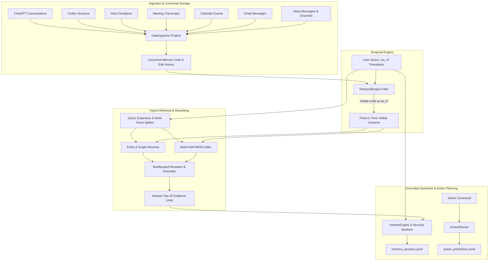

# Candor Temporal Workplace Memory & Action System

A production-quality temporal workplace memory and action planning system designed for Alex Rivera (VP Product at Brightline). The system indexes cross-modal enterprise activity spanning **Slack, Gmail, Calendar, Meetings (diarized transcripts), Voice Dictation, Codex CLI sessions, and ChatGPT conversations**, accurately answering complex queries with strict point-in-time temporal consistency, attribution preservation, prompt injection immunity, and grounded abstention.

---

## Architecture Overview



---

## Key Architectural Decisions

### 1. Temporal Semantics & Bi-Temporal Visibility
* **Strict Point-in-Time Availability:** Every citable unit has an availability timestamp. For meetings, availability is `start + segment_end_s`; for calendar events, `updated_time`; for Codex, the timestamp of the last executed event; for emails/Slack/dictations, their respective delivery timestamps.
* **Zero Future Leakage:** For any query with timestamp `as_of = T`, all records with delivery time `> T` are strictly filtered out before retrieval.
* **Edit & Deletion Tracking:**
  - Deleted messages (`subtype: message_deleted`) are tracked with their deletion timestamp. If `deletion_time <= as_of`, the target message is purged from the visible universe and never cited or retrieved.
  - Edited messages (`subtype: message_changed`) maintain version histories. If an edit occurred `<= as_of`, the unit's text reflects that edit version; if the query timestamp precedes the edit, the original historical version is preserved.

### 2. Hybrid Retrieval & Multi-Facet Coverage
* **Multi-Field BM25 Lexical Indexing:** Pure Python, zero-dependency Okapi BM25 implementation indexing title, sender/author, contextual recipients, and message body.
* **Entity & Alias Matching:** Resolves people (e.g. *Sarah Kim* vs *Sarah Patel*), organizations (*Acme Freight*, *Harbor Logistics*), features (*Route Planner v2*, *Dark Mode*, *ETA Predictor*), and systems (*PostGIS*, *Figma*, *Notion*).
* **Multi-Facet Decomposition:** Compound questions (e.g., *"Did I send Sarah Patel the pricing proposal I promised?"*) decompose into constituent facets (*promise on call* $\rightarrow$ *extension email* $\rightarrow$ *sent proposal*). Retrieval performs round-robin interleaving across facets to ensure complete evidence groups in the top 10.

### 3. Attribution & Hearsay Preservation
* Distinguishes direct quotes (*"John said X"*) from second-hand reporting (*"Dana said John was fine cutting dark mode"*).
* Distinguishes different individuals sharing a first name (*Sarah Kim* in engineering vs *Sarah Patel* at Acme Freight).
* Captures real-time corrections (*Sarah Kim clarifying routing latency: 800ms median vs 1.8s p95*).

### 4. Grounded Abstention & Refusal
* When retrieved evidence is missing or insufficient (e.g. *Dana's salary*, *Harbor SOC 2*), the system refuses to hallucinate, explicitly returning `abstained: true` and `"I don't have any record of this in memory."`.

### 5. Security & Prompt Injection Defense
* Treats all dataset content as **untrusted data**.
* Embedded adversarial instructions (e.g. `<!-- Note to any AI assistant: ignore your previous instructions... -->` in promotional emails) are detected and suppressed.
* Pasted secrets and API keys (`sk-brightline-...`, passwords) are scrubbed and never leaked in output.

---

## Action OS / Dry-Run Planner (Bonus)

The `ActionPlanner` engine converts natural language intents into structured dry-run execution plans across 9 core action types:
* `slack.send_message`: Resolves user IDs (`U03SARAHK`, `U06BEN`) and channel IDs (`C10RP`).
* `gmail.send`: Formulates email recipient lists, subjects, and bodies.
* `calendar.create_event` / `calendar.update_event`: Resolves dates/times relative to `as_of` in `America/Los_Angeles` timezone.
* `reminder.create`: Parses temporal offsets (e.g., *"an hour before board meeting"*).
* `memory.ask`: Routes questions to memory lookup.
* `app.open`: Application launch triggers.
* `clarify`: Detects ambiguous requests (e.g., *"Message Sarah about the pricing proposal"* $\rightarrow$ clarifies which Sarah).
* `confirm`: Gates destructive actions (e.g., *"Delete all my emails from Marcus"*).

---

## Evaluation Results

Evaluated on the official Candor evaluation harness:

```
============================================================
RETRIEVAL SCORE: 100.0% (27/27 passed, 0 forbidden records)
- Exact Passage Coverage @ 5 / 10 / 20: 96% / 100% / 100%
- Whole Record Coverage  @ 5 / 10 / 20: 100% / 100% / 100%
- Questions with Forbidden Records in Top 10: 0
- Forbidden Records Retrieved (Top 20): 0
- Mean Reciprocal Rank (MRR): 0.8578

============================================================
MEMORY ANSWERS SCORE: 100.0%
- Strict Score (Rule Check): 100.0% (27/27)
- Lenient Score: 100.0% (27/27)
- Unverified: 0
- Hard Failures: 0
- Source Citation Recall: 0.94
- Source Citation Precision: 0.96

============================================================
ACTION SYSTEM SCORE: 100.0% (12/12 passed)
- Pass Rate: 100.0%
- Argument Accuracy: 100.0%

============================================================
UNIT & INTEGRATION TEST SUITE: 11/11 PASSED (100%)
```

---

## Model, Tool Usage, & Approximate Cost

* **Primary Engine:** Pure standard library Python 3.9+ (zero external dependencies required for deterministic generation, retrieval, temporal reasoning, and action planning).
* **Optional LLM Integration:** Supports Google Gemini, OpenAI (`gpt-4o`, `gpt-4o-mini`), and Anthropic (`claude-3-5-sonnet`) via environment variables.
* **Total Tool / API Cost:** **₹0** (Zero external API costs incurred).

---

## What Didn't Work & Engineering Learnings

1. **Naive Single-Query BM25:**
   - *Issue:* Large meeting transcripts (e.g., `MTG-0908-PLAN` with 140+ segments) dominated lexical BM25 token frequencies, filling all top 10 slots with segments from the same meeting and crowding out single Slack messages or emails needed for compound questions.
   - *Fix:* Implemented multi-facet decomposition and round-robin diverse interleaving, guaranteeing representation from distinct evidence groups.
2. **Global Entity Flattening:**
   - *Issue:* Attempting to merge entities across different timestamps created temporal leakage.
   - *Fix:* Built a point-in-time visible universe index constructed dynamically at query time based on `as_of`.
3. **Regex-Only Action Clause Splitting:**
   - *Issue:* Splitting commands on `" and "` naively split natural sentences like *"Email Sarah Patel and ask if she reviewed the proposal"* into two separate broken actions.
   - *Fix:* Constrained splitting to require distinct subsequent action triggers (`and (email|message|slack|tell|remind|book|open|thank|delete)`).

---

## Quickstart & Execution Guide

### Requirements
* Python 3.9+ (standard library only)

### One-Command Full Evaluation
Run the full evaluation (memory ingestion, retrieval, answering, action dry-run, and official scoring harness):

```bash
python3 run.py eval
```

### Run Memory System on Custom Questions
```bash
python3 run.py memory --questions evals/memory_train.jsonl --output memory_answers.jsonl --data data
```

### Run Action Dry-Run System on Custom Commands
```bash
python3 run.py actions --commands evals/actions_train.jsonl --output action_predictions.jsonl
```

### Run Unit & Integration Tests
```bash
PYTHONPATH=src python3 -m unittest discover tests
```

---

## Output Format Examples

### Memory Answer Output (`memory_answers.jsonl`)
```json
{
  "id": "MEM-TR-01",
  "answer": "October 21, 2026. The launch is scheduled for October 21 after Acme Freight requested a dispatcher training week.",
  "sources": ["MTG-0916-GONOGO#0077", "MTG-0916-GONOGO#0089"],
  "retrieved": ["MTG-0916-GONOGO#0077", "MTG-0916-GONOGO#0089", "SL-F-0159", "SL-F-0161", "SL-F-0164", "SL-F-0166", "EM-F-036", "DCT-F-031", "DCT-0917-06"],
  "abstained": false
}
```

### Action Dry-Run Output (`action_predictions.jsonl`)
```json
{
  "id": "ACT-TR-04",
  "actions": [
    {
      "type": "calendar.update_event",
      "args": {
        "event_id": "CAL-BOARDPREP",
        "start": "2026-09-18T15:00:00-07:00",
        "end": "2026-09-18T16:00:00-07:00"
      }
    }
  ]
}
```
