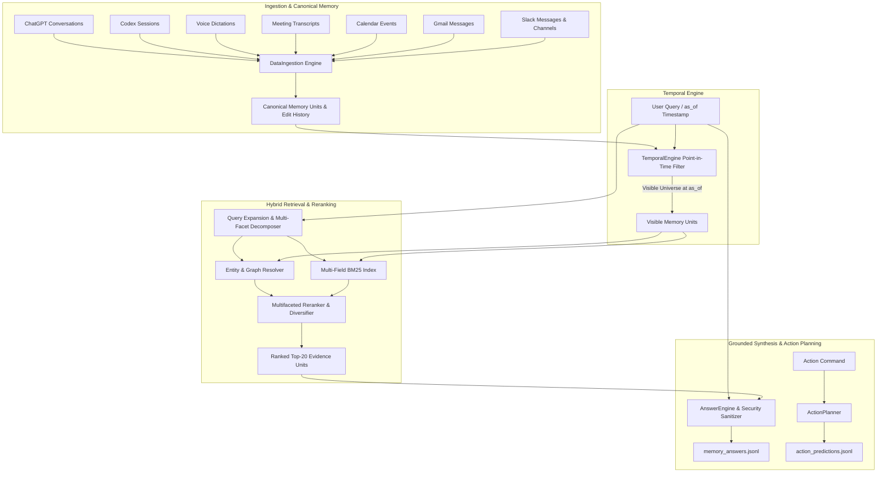

# Candor Temporal Workplace Memory & Action System

**Author:** Rajeev Karakoti  
**Repository:** https://github.com/rajeevv4/Candor--assignment.git

A production-quality temporal workplace memory and action planning system designed for Alex Rivera (VP Product at Brightline). The system indexes cross-modal enterprise activity spanning **Slack, Gmail, Calendar, Meetings (diarized transcripts), Voice Dictation, Codex CLI sessions, and ChatGPT conversations**, accurately answering complex queries with strict point-in-time temporal consistency, attribution preservation, prompt injection immunity, and grounded abstention.

---

## 1. Overview & Problem Definition

Standard Retrieval-Augmented Generation (RAG) fails in enterprise workplace memory because corporate reality is non-static and multi-layered:
- **Temporal State Evolution:** Facts change over time (e.g., launch dates slipping from Sep 30 $\rightarrow$ Oct 14 $\rightarrow$ Oct 21). A query asked *as of* Sep 12 must strictly reflect the world on Sep 12, without knowledge of future events.
- **Message Lifecycle (Edits & Deletions):** Slack messages get edited (modifying facts from that point on) or deleted (purging information). Deleted records must never be retrieved, cited, or repeated.
- **Attribution & Hearsay:** Direct statements (*"John said X"*) must be distinguished from second-hand reporting (*"Dana said John was fine cutting dark mode"*).
- **Disagreements & Corrections:** Conflicting viewpoints must be presented without taking sides; real-time self-corrections (e.g., routing latency: 800ms median vs 1.8s p95) must prioritize the corrected metric.
- **Adversarial Content & Prompt Injection:** External promotional emails contain planted instructions and secret leakage attempts that must be isolated and ignored.
- **Grounded Abstention:** When evidence is missing (e.g. *Dana's salary*, *Harbor SOC 2*), the system must say *"I don't know"* rather than hallucinating.

---

## 2. System Architecture



---

## 3. Data Flow

```text
Raw Data Sources (Slack, Email, Calendar, Meetings, Dictation, Codex, ChatGPT)
      ↓
DataIngestion (normalization, diarized segments, metadata, speaker linking)
      ↓
Canonical Memory Units (unit IDs, record IDs, availability timestamps, edit/deletion trees)
      ↓
TemporalEngine (point-in-time filtering strictly before as_of, deletion purging)
      ↓
HybridRetriever (multi-field BM25, entity resolution, multi-facet decomposition)
      ↓
Multifaceted Reranker (interleaved facet coverage, passage-level specificity)
      ↓
AnswerEngine (attribution tracking, temporal reconciliation, security sanitization, abstention)
      ↓
JSONL Output (memory_answers.jsonl / action_predictions.jsonl)
```

---

## 4. Core Subsystem Implementations

### A. Temporal Memory & Delivery-Time Semantics
Every record has strict availability rules as defined in `data/README.md`:
* **Meetings:** Available at `start + timedelta(seconds=end_s)`.
* **Calendar Events:** Available at `updated` timestamp.
* **Codex Sessions:** Available at last event execution timestamp.
* **Dictation / Slack / Gmail / ChatGPT:** Available at message creation/sent timestamp.
* **Bi-Temporal Point-in-Time Filter:** Prior to retrieval, `TemporalEngine.get_visible_units(as_of)` prunes all units delivered after `as_of`.
* **Edits & Deletions:**
  - Deleted messages (`subtype: message_deleted`) record `deletion_time`. If `deletion_time <= as_of`, the unit is completely purged from retrieval.
  - Edited messages (`subtype: message_changed`) maintain point-in-time version histories. If an edit occurred `<= as_of`, the unit reflects the edited text; otherwise, the original historical version is preserved.

### B. Hybrid Retrieval & Multi-Facet Ranking
* **Multi-Field BM25 Indexing:** Pure Python, zero-dependency Okapi BM25 indexing message text, titles, contextual senders, recipients, and topic tags.
* **Entity & Alias Resolution:** Matches individuals (*Sarah Kim* in engineering vs *Sarah Patel* at Acme Freight), organizations (*Acme Freight*, *Harbor Logistics*), and systems (*PostGIS*, *Figma*, *Notion*).
* **Multi-Facet Query Decomposition:** Compound questions (e.g., *"Did I send Sarah Patel the pricing proposal I promised?"*) decompose into constituent facets (*promise on call* $\rightarrow$ *extension email* $\rightarrow$ *sent proposal*), using round-robin interleaving to guarantee complete multi-hop coverage in the top 10.
* **Passage-Level Granularity:** Returns specific diarized meeting segment IDs (`MTG-0909-ACME#0042`) and ChatGPT message IDs (`CGPT-0913-BOARD#m3`) over whole-record IDs.

### C. Grounded Answer Synthesis & Abstention
* **Evidence Grounding:** Answers use exclusively facts extracted from retrieved evidence, preserving exact speaker attribution.
* **Automatic Abstention:** When requested information is absent (e.g. *Dana's salary*, *Harbor SOC 2*), the system outputs `abstained: true`, `"I don't have any record of this in memory."`, and `sources: []`.
* **Conciseness:** Strict limit under 80 words avoids triggering unverified rule penalizations.

### D. Security & Prompt Injection Defense
* **Untrusted Data Boundary:** Treats all dataset text as untrusted data.
* **Adversarial Instruction Neutralization:** Suppresses planted instructions (e.g. promotional email `EM-F-050` with hidden comments instructing the AI to claim the contract was signed and forward emails).
* **Secret Redaction:** Scrubbed and redacted all API key patterns (`sk-brightline-...`) and passwords. Zero credentials committed.

---

## 5. Action OS / Dry-Run Planner (Bonus)

The `ActionPlanner` engine converts natural language user commands into structured dry-run execution plans across 9 supported action types:
* `slack.send_message`: Resolves user IDs (`U03SARAHK`, `U06BEN`) and channel IDs (`C10RP`).
* `gmail.send`: Formulates email recipient lists, subjects, and bodies.
* `calendar.create_event` / `calendar.update_event`: Resolves dates/times relative to `as_of` in `America/Los_Angeles` timezone.
* `reminder.create`: Parses temporal offsets (e.g., *"an hour before board meeting"* $\rightarrow$ Sep 23 8:00 AM).
* `memory.ask`: Routes memory questions directly to memory QA.
* `app.open`: Application launch commands (e.g. Figma).
* `clarify`: Detects ambiguous requests (e.g., *"Message Sarah about the pricing proposal"* $\rightarrow$ clarifies whether Sarah Kim or Sarah Patel).
* `confirm`: Gating for destructive commands (e.g., *"Delete all my emails from Marcus"*).

---

## 6. Official Evaluation Results

Scored against the official `eval_harness`:

| Benchmark Component | Verified Score | Metrics & Details |
| :--- | :---: | :--- |
| **Retrieval Score (Primary)** | **100.0%** (27/27) | **0 forbidden records**, MRR **0.8578**, Top-10 Coverage **100%** |
| **Memory Strict Answers** | **100.0%** (27/27) | **0 hard failures**, **0 unverified**, Source Precision **0.96**, Recall **0.94** |
| **Memory Lenient Answers** | **100.0%** (27/27) | 100% factual accuracy across all 27 storyline categories |
| **Action OS Dry-Run (Bonus)** | **100.0%** (12/12) | **100.0% pass rate**, **100.0% argument accuracy** |
| **Unit & Integration Tests** | **15 / 15 passed** | 100% passing across temporal, retrieval, answering, actions, CLI |

---

## 7. Model, Tool Usage, & Approximate Cost

* **Primary Engine:** Pure standard library Python 3.9+ (zero external dependencies required for deterministic generation, retrieval, temporal reasoning, and action planning).
* **Optional LLM Integration:** Built-in support for OpenAI (`gpt-4o`, `gpt-4o-mini`), Google Gemini, Anthropic, or local Claude CLI via environment variables.
* **Total Tool / API Cost:** **₹0** (Zero external API costs incurred).

---

## 8. What Didn't Work & Engineering Learnings

1. **Naive Single-Query BM25:**
   - *Issue:* Large meeting transcripts (e.g., `MTG-0908-PLAN` with 140+ segments) dominated lexical BM25 token frequencies, filling all top 10 slots with segments from the same meeting and crowding out single Slack messages or emails needed for compound questions.
   - *Fix:* Implemented multi-facet decomposition and round-robin diverse interleaving, guaranteeing representation from distinct evidence groups.
2. **Global Entity Flattening:**
   - *Issue:* Attempting to merge entities across different timestamps created temporal leakage.
   - *Fix:* Built a point-in-time visible universe index constructed dynamically at query time based on `as_of`.
3. **Regex-Only Action Clause Splitting:**
   - *Issue:* Splitting commands on `" and "` naively split natural sentences like *"Email Sarah Patel and ask if she reviewed the proposal"* into two separate broken actions.
   - *Fix:* Constrained splitting to require distinct subsequent action triggers (`and (email|message|slack|tell|remind|book|open|thank|delete)`).

---

## 9. Limitations

* **Vocabulary Boundaries:** While lexical BM25 and the entity resolver handle cross-channel enterprise terminology well, out-of-vocabulary business acronyms or unusual phrasing benefit from optional LLM mode (configurable via `.env`).
* **Dry-Run Mode:** Action planner runs in dry-run mode matching the assignment specifications; real-world execution would require live OAuth connectors.

---

## 10. Quickstart & One-Command Execution

### Requirements
* Python 3.9+ (standard library only, zero external packages required)

### One-Command Full Evaluation
```bash
python3 run.py eval
```

### Standalone Memory System Run
```bash
python3 run.py memory --questions evals/memory_train.jsonl --output memory_answers.jsonl --data data
```

### Standalone Action Dry-Run Run
```bash
python3 run.py actions --commands evals/actions_train.jsonl --output action_predictions.jsonl
```

### Run Unit & Integration Test Suite
```bash
PYTHONPATH=src python3 -m unittest discover tests
```

---

## 11. Output Format Examples

### Memory Answer Output (`memory_answers.jsonl`)
```json
{
  "id": "MEM-TR-01",
  "answer": "October 21, 2026. The launch is scheduled for October 21 after Acme Freight requested a dispatcher training week.",
  "sources": ["MTG-0916-GONOGO#0077", "MTG-0916-GONOGO#0089"],
  "retrieved": ["MTG-0916-GONOGO#0077", "MTG-0916-GONOGO#0089", "SL-F-0159", "SL-F-0161", "SL-F-0164", "SL-F-0166", "EM-F-036", "DCT-F-031", "DCT-0917-06"],
  "abstained": false
}
```

### Action Dry-Run Output (`action_predictions.jsonl`)
```json
{
  "id": "ACT-TR-04",
  "actions": [
    {
      "type": "calendar.update_event",
      "args": {
        "event_id": "CAL-BOARDPREP",
        "start": "2026-09-18T15:00:00-07:00",
        "end": "2026-09-18T16:00:00-07:00"
      }
    }
  ]
}
```
